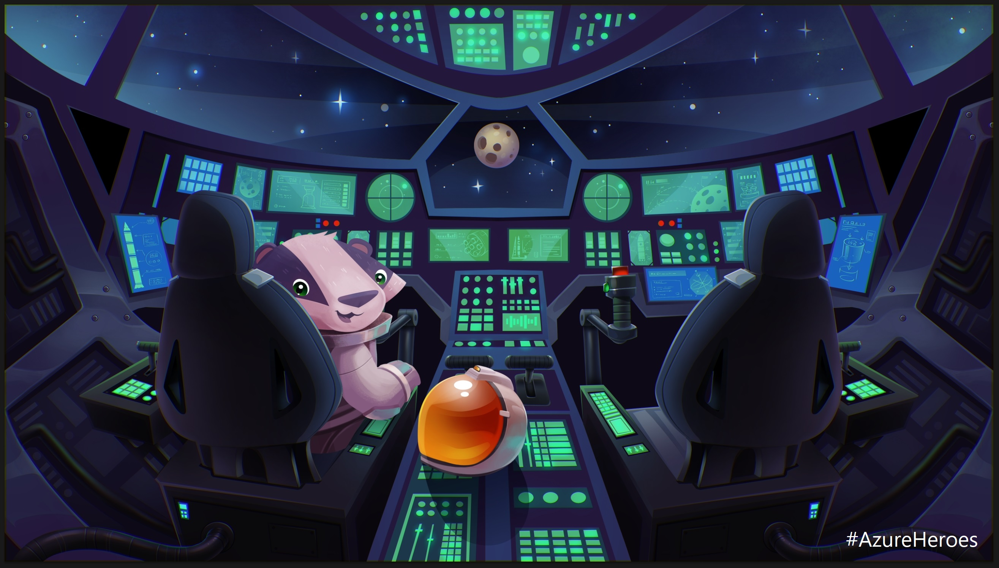

# HashiConf Digital 2020: Terraform on Azure Coding Challenge 🚀

Our [Azure Heroes](https://aka.ms/azure.heroes?ocid=aid3015373_ThankYou_DevComm&eventId=HashiConfTerraformonAzure_JK1-K2-hoArJ) badger has a startup idea that is out of this world! For their interstellar delivery service, they need your help developing an app leveraging the best of Terraform, Azure, and Azure managed Kubernetes. Help them deploy their application, so they can concentrate on the quality of their galactic snacks.

*Are you ready to show off your Terraform and Azure skills to send our astronaut badger into space?*

**Click** on the [introduction video](https://youtu.be/56tTDamp8DE) below to learn all about it!

Our **Final** Coding Challenge #5 is now available for you to work on!

## How does it work? 🧰

This week (June 22-26), while HashiConf Digital takes place, we're releasing a **daily #TerraformOnAzure coding challenge**. You have **24 hours** to submit your coding challenge solution, before we will publish ours in this repo.

Of course, you're free to continue to work longer on your coding challenge and still it! We want to learn from you as well! The goal is for everyone to learn and expore.

Get your exclusive [space-themed gift](./challenges/assets/TerraformOnAzure-Background-Final.jpg) now 🎁! We have created an exclusive, custom background, for you to use in all your video calls!

## Challenges 💻

| Date | Challenge | Description | Video | 
| ---- | --------- | ----------- | ----- | 
| June 22, 2020 | [Challenge 1](./challenges/challenge1/Readme.md) | Deploying an Azure App Service using Terraform CLI and the Azure CLI |[day1](https://youtu.be/56tTDamp8DE) | 
| June 23, 2020 | [Challenge 2](./challenges/challenge2/Readme.md) | Deploying databases on Azure using Terraform CLI | [day2](https://aka.ms/tfonazure/vid/day2) | 
| June 24, 2020 | [Challenge 3](./challenges/challenge3/Readme.md) | Remote state and CI/CD with GitHub Actions | [day3](https://aka.ms/tfonazure/vid/day3) | 
| June 25, 2020 | [Challenge 4](./challenges/challenge4/Readme.md) | Deploying on Azure Kubernetes Service | [day4](https://aka.ms/tfonazure/vid/day4) | 
| June 26, 2020 | [Challenge 5](./challenges/challenge5/README.md) | Connecting it all with Consul | [day5](https://aka.ms/tfonazure/vid/day5) | 

## Submit your solutions? 🔥

You can find the detailed instructions in our [Contributing.md](Contributing.md) guidelines, but here's the TL;DR.

* Submit your solution as a new [Challenge Solution Submission ISSUE](https://github.com/Terraform-On-Azure-Workshop/terraform-azure-hashiconf2020/issues/new/choose) for each challenge to this GitHub repository.

We'd love it if you also **share your experience on social media**! You can use the **#TerraformOnAzure** Twitter hashtag to do so.

## Suggested resources 🚀

* [Visual Studio Code](https://code.visualstudio.com?ocid=aid3015373_ThankYou_DevComm&eventId=HashiConfTerraformonAzure_JK1-K2-hoArJ)
* Azure Subscription: [Send us a DM on Twitter](https://twitter.com/msdev_nl) or [sign up](https://azure.microsoft.com/en-us/free/?ocid=aid3015373_ThankYou_DevComm&eventId=HashiConfTerraformonAzure_JK1-K2-hoArJ) for a free Azure account
* [Terraform](https://www.terraform.io/)

## Contributing 🚩

This project welcomes contributions and suggestions. Most contributions require you to agree to a Contributor License Agreement (CLA) declaring that you have the right to, and actually do, grant us the rights to use your contribution. For details, visit https://cla.opensource.microsoft.com.

When you submit a pull request, a CLA bot will automatically determine whether you need to provide a CLA and decorate the PR appropriately (e.g., status check, comment). Simply follow the instructions provided by the bot. You will only need to do this once across all repos using our CLA.

This project has adopted the [Microsoft Open Source Code of Conduct](https://opensource.microsoft.com/codeofconduct/). For more information see the [Code of Conduct FAQ](https://opensource.microsoft.com/codeofconduct/faq/) or contact [opencode@microsoft.com](mailto:opencode@microsoft.com) with any additional questions or comments.
